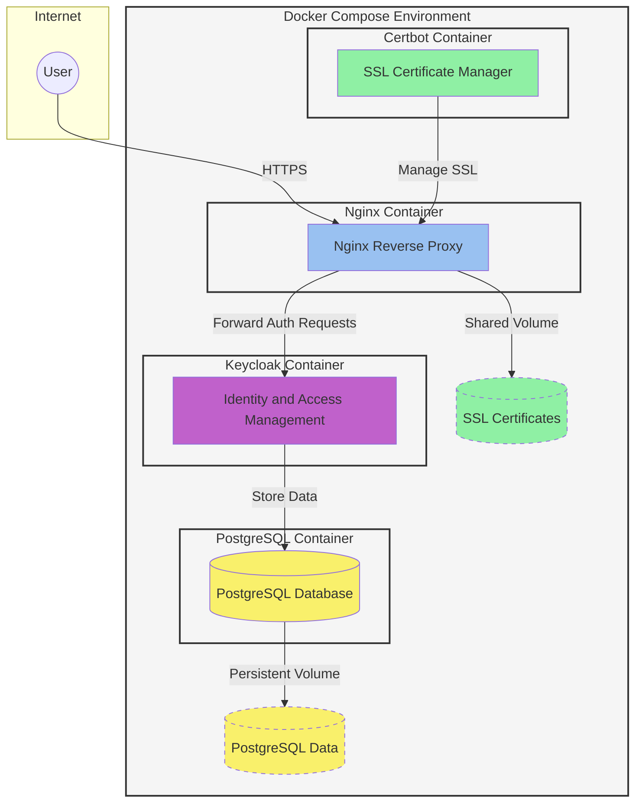

# Keycloak + PostgreSQL + Nginx + Certbot in a Docker Compose Stack

## Introduction

This project sets up a secure Keycloak server using PostgreSQL as the database, Nginx as a reverse proxy, and Certbot for SSL certificates, all managed through Docker Compose.

## Prerequisites

Before starting, ensure you have the following:

- **VM on GCP** (or any cloud provider): Make sure it’s configured and running with open ports 80 (HTTP) and 443 (HTTPS).
- **A valid domain name**: Ensure the domain is correctly pointing to your server's IP address.
- **Docker Engine**: [Install Docker](https://docs.docker.com/get-docker/).
- **Docker Compose**: [Install Docker Compose](https://docs.docker.com/compose/install/).

## Architecture




## Installation

### 1. Clone the Repository

First, clone the repository from GitHub:

```bash
git clone https://github.com/anqorithm/keycloak-production.git
cd keycloak-production
```

### 2. Configure Environment Variables

Copy the provided `.env.example` to `.env` and adjust the variables to fit your setup:

```bash
cp .env.example .env
```

Update the following in the `.env` file:
- `KEYCLOAK_DOMAIN`: Your valid domain name.
- `CERTBOT_LETSENCRYPT_EMAIL`: Your email address for SSL certificate registration.

### 3. SSL Setup (Run First)

Before starting the main stack, set up SSL certificates for your domain:

1. Make sure your domain is properly configured and pointing to your server.
2. Ensure ports **80** and **443** are open.
3. Run the SSL setup using Certbot:

   ```bash
   docker compose -f docker-compose-ssl.yml up -d
   ```

4. Once the certificates are successfully obtained, stop the containers:

   ```bash
   docker compose -f docker-compose-ssl.yml down
   ```

### 4. Start the Main Stack

With SSL certificates in place, start the entire stack:

```bash
docker compose up -d
```

This will launch Keycloak, PostgreSQL, and Nginx, all configured to use SSL.

### 5. Set Up Automatic Certificate Renewal

To keep your SSL certificates updated, configure `crontab` to renew them automatically every 12 hours:

```bash
crontab -e
```

Add the following entry to run the renewal command:

```bash
0 */12 * * * docker compose run --rm certbot
```

## Keycloak Admin Information

- Default admin username: `admin`
- Default admin password: `admin`

These can be changed in the `.env` file under `KEYCLOAK_ADMIN` and `KEYCLOAK_ADMIN_PASSWORD`.

## Configuration

All configuration is managed through environment variables in the `.env` file:

| **Variable**                  | **Description**                        | **Default Value**        | **Required** |
|-------------------------------|----------------------------------------|--------------------------|--------------|
| `KEYCLOAK_DOMAIN`              | Domain for the Keycloak server         |                          | Yes          |
| `CERTBOT_LETSENCRYPT_EMAIL`    | Email for Let's Encrypt registration   |                          | Yes          |
| `SUBNET`                       | Subnet for container network           | 172.16.0.0/29            | No           |
| `KEYCLOAK_VERSION`             | Keycloak image version                 | latest                   | No           |
| `POSTGRES_VERSION`             | PostgreSQL image version               | latest                   | No           |
| `POSTGRES_KEYCLOAK_PASSWORD`   | Password for Keycloak PostgreSQL user  | keycloak                 | No           |
| `NGINX_VERSION`                | Nginx image version                    | latest                   | No           |
| `CERTBOT_VERSION`              | Certbot image version                  | latest                   | No           |

## Contributing

Feel free to contribute by:

- Submitting a pull request with new features or bug fixes.
- Helping users by answering questions and resolving issues.

## License

This project is licensed under the MIT License. See the `LICENSE` file for details.
